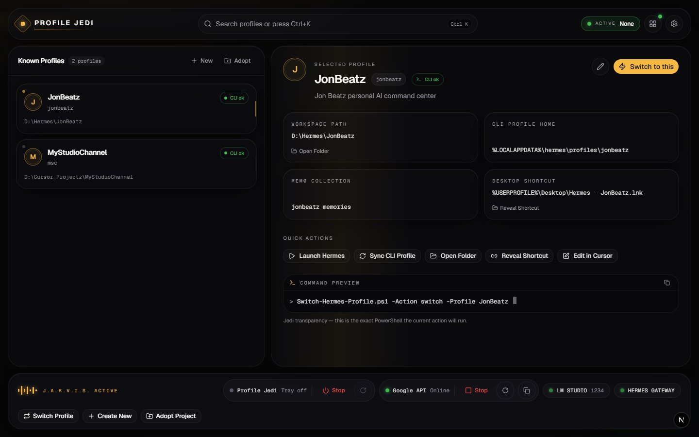
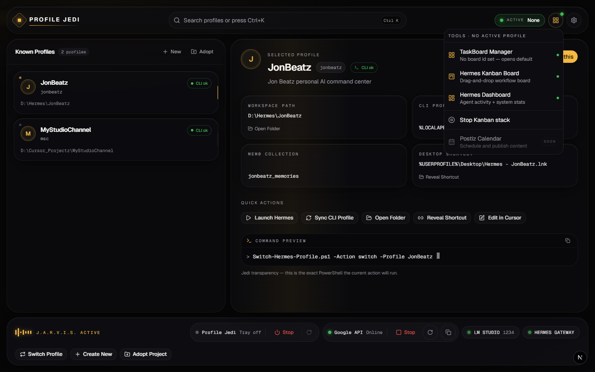
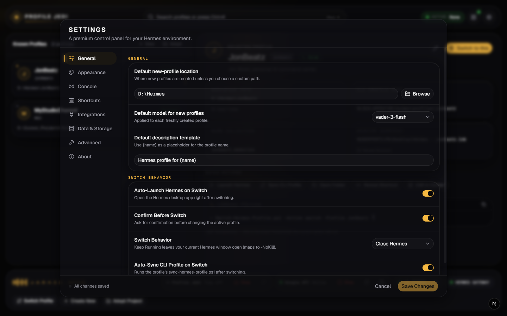
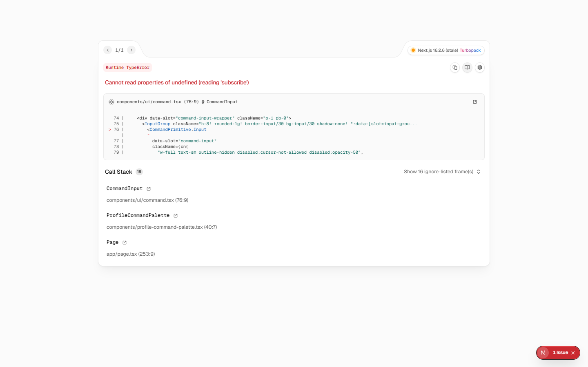

# Profile Jedi — Hermes Profile Switcher

**A local-first control panel for managing Hermes AI-agent profiles.**  
Switch, create, adopt, and launch self-contained agent workspaces from a premium Next.js dashboard — with full PowerShell backend transparency, service health monitoring, and tray-based lifecycle control.



[](https://nextjs.org/)
[](https://react.dev/)
[](https://www.typescriptlang.org/)
[](https://tailwindcss.com/)
[](https://opensource.org/licenses/MIT)
[](https://cursor.com/)
[](https://github.com/jonbeatz/profile-jedi)
[](Hermes-Profile-Switcher.md)

[](https://github.com/jonbeatz/profile-jedi/releases/latest)

---

> **Single source of truth:** Read **[`Hermes-Profile-Switcher.md`](Hermes-Profile-Switcher.md)** for architecture, API routes, ports, backend wiring, extension recipes, and troubleshooting. Agents: start with **[`AGENTS.md`](AGENTS.md)** and **[`TRUTH.md`](TRUTH.md)**.

## Current Status

| Metric | Value |
|--------|-------|
| **Version** | v1.0.0 ([Latest release](https://github.com/jonbeatz/profile-jedi/releases/latest)) |
| **Stack** | Next.js 16 (App Router) · React 19 · TypeScript · Tailwind v4 · shadcn/Base UI · Motion · SWR |
| **App URL** | `http://localhost:7780` (bound to `127.0.0.1` only) |
| **Tray control** | `http://localhost:7781` (system tray supervisor) |
| **Backend** | `Switch-Hermes-Profile.ps1` + Google API + Kanban stack scripts |
| **API routes** | 15 Route Handlers for full local control |
| **Status** | Production-ready for local desktop use |

---

## Screenshots

### Profile Command Center

*Known profiles sidebar, workspace/CLI/mem0 paths, quick actions, and live PowerShell command preview.*

### Extras & TaskBoard Tools

*Per-project TaskBoard deep-links, Hermes Kanban, Dashboard, and Kanban stack control.*

### Settings & Integrations

*Seven-section settings: General, Appearance, Console, Shortcuts, Integrations, Data, and Advanced.*

### Command Palette

*Fuzzy search to switch profiles, create new, or adopt an existing folder — `Ctrl+K`.*

---

## Why Profile Jedi?

Historically, Hermes profiles were switched from PowerShell. Profile Jedi wraps that engine in a **J.A.R.V.I.S.-style dashboard** so every action is point-and-click — while still showing the exact command that will run.

| Capability | Profile Jedi | Manual PowerShell |
|------------|--------------|-------------------|
| Profile list / switch / create / adopt / edit | Yes | Script flags only |
| Live command preview + Dry-Run mode | Yes | No |
| Google API stack (LiteLLM + ngrok) control | Yes | Separate scripts |
| TaskBoardAI / Kanban per-project deep-links | Yes | Manual URLs |
| Service health footer (TCP probes) | Yes | No |
| System tray Start / Stop / Restart | Yes | No |
| Settings panel (appearance, shortcuts, integrations) | Yes | No |
| Agent-ready master documentation | Yes | README only |

---

## Quick Start

### Prerequisites

- **Node.js** 20+ and **pnpm** (or npm)
- **Windows 10/11** with PowerShell 5.1+
- **Hermes** profile-switcher backend at `D:\Hermes\projects\_core-scripts\profile-switcher\` (or set `HERMES_ROOT` / `PJ_SWITCHER_SCRIPT`)

### Install & run

```powershell
git clone https://github.com/jonbeatz/profile-jedi.git
cd profile-jedi
pnpm install
pnpm dev
```

Open **`http://localhost:7780`**.

### Desktop shortcuts (recommended)

```powershell
powershell -NoProfile -ExecutionPolicy Bypass -File .\create-profile-jedi-shortcuts.ps1 -Startup
```

Creates **Profile Jedi**, **Stop Profile Jedi**, and **Profile Jedi Tray** on the Desktop; optional `-Startup` auto-launches the tray on login.

### Verify

```powershell
npx tsc --noEmit
Invoke-WebRequest http://127.0.0.1:7780/ -UseBasicParsing
Invoke-WebRequest http://localhost:7781/status -UseBasicParsing   # when tray is running
```

---

## Architecture

```
Profile Jedi (browser :7780)
├── Next.js Route Handlers     app/api/**  →  lib/server/*
├── Tray Supervisor (:7781)    profile-jedi-tray.ps1  (survives app stop)
├── PowerShell backend         Switch-Hermes-Profile.ps1
├── Google API stack           LiteLLM :4000 · ngrok :4040
└── Kanban stack               TaskBoardAI :3001 · Kanban :3005 · Dashboard :9119
```

The browser never runs PowerShell directly. Route Handlers call `lib/server/ps.ts` (`execFile`, safe args). The tray supervisor on **7781** can restart the app after an in-app self-destruct on **7780**.

---

## Core Features (v1.0.0)

- **Profile management** — list, switch, create, adopt, edit (name / description / path / `boardId`)
- **Quick actions** — Launch Hermes, Sync CLI, Open Folder, Reveal Shortcut, Edit in Cursor
- **J.A.R.V.I.S. footer** — Google API control + service health capsules + app lifecycle cluster
- **Extras menu** — TaskBoardAI (per-profile `boardId`), Hermes Kanban, Hermes Dashboard
- **Settings** — General, Appearance, Console, Shortcuts, Integrations, Data, Advanced
- **Lifecycle** — tray supervisor, desktop shortcuts, in-app Stop + Restart via supervisor
- **Transparency** — command preview on every action; Dry-Run mode; last command output drawer

---

## Ports

| Port | Service |
|------|---------|
| 7780 | Profile Jedi app |
| 7781 | Tray supervisor HTTP API |
| 4000 | LiteLLM |
| 4040 | ngrok inspector |
| 1234 | LM Studio (health probe) |
| 3001 | TaskBoardAI |
| 3005 | Hermes Kanban |
| 9119 | Hermes Dashboard |

---

## Documentation

| Document | Purpose |
|----------|---------|
| [Hermes-Profile-Switcher.md](./Hermes-Profile-Switcher.md) | Master reference — architecture, API, ports, extension recipes |
| [AGENTS.md](./AGENTS.md) | Agent cold-start instructions |
| [TRUTH.md](./TRUTH.md) | Project constitution (final authority) |
| [CHANGELOG.md](./CHANGELOG.md) | Release history |
| [specs/](./specs/) | Feature specs and planning templates |

---

## Environment overrides

| Variable | Default | Purpose |
|----------|---------|---------|
| `HERMES_ROOT` | `D:\Hermes` | Hermes install root |
| `MSC_ROOT` | `D:\Cursor_Projectz\MyStudioChannel` | Kanban stack scripts |
| `PJ_SWITCHER_SCRIPT` | `...\Switch-Hermes-Profile.ps1` | Profile engine path |
| `PJ_EXEC_POLICY` | `Bypass` | PowerShell execution policy |

---

## Related projects

- **[MyStudioChannel](https://github.com/jonbeatz/MyStudioChannel)** — creator platform (separate Hermes profile, `slug: msc`)
- **Hermes profile-switcher** — lives under `D:\Hermes\projects\_core-scripts\profile-switcher\` (not in this repo)

---

## Contributors

- **Jon Beatz** — Creator & Developer  
  - GitHub: [@jonbeatz](https://github.com/jonbeatz)  
  - Email: createmystudiochannel@gmail.com

---

## License

MIT © Jon Beatz

---

<p align="center">
  <sub>· Powered by the Hermes Profile Switcher · NovaMira Studio Gold aesthetic</sub>
</p>
